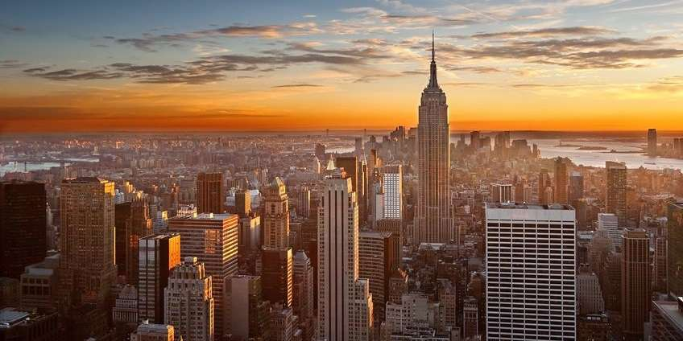
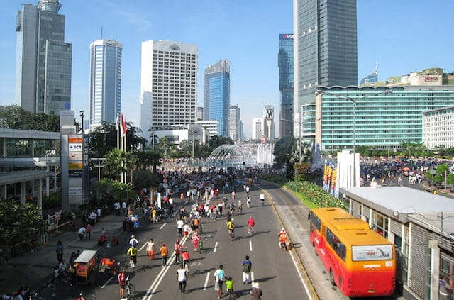
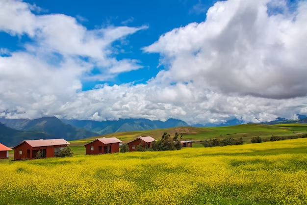
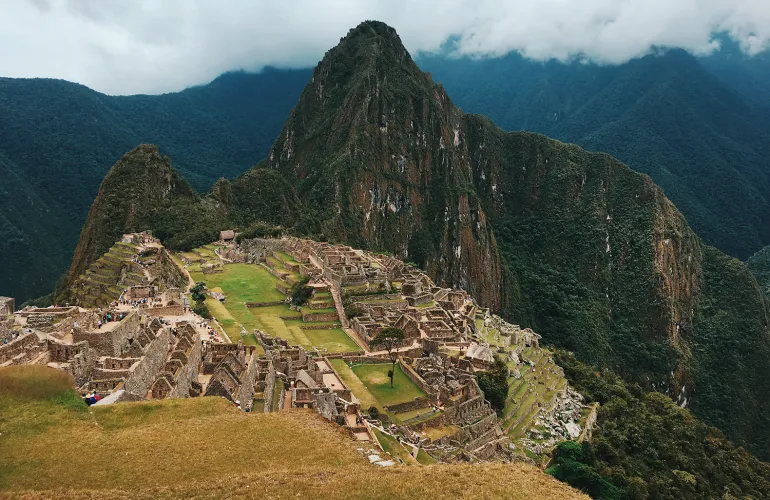

## Objetivo del trabajo.
### 1.2 Nuestro Caso de Uso
El proyecto plantea analizar un conjunto de 50 imágenes (25 de zonas urbanas y 25 de zonas rurales) obtenidas de fuentes en internet. La principal motivación es identificar diferencias visuales entre los dos tipos de entornos, enfocándose particularmente en aspectos relacionados con los niveles de contaminación y la composición de colores. Las imágenes urbanas suelen estar caracterizadas por una mayor presencia de grises y tonos más apagados debido a la contaminación y la construcción, mientras que las imágenes rurales tienden a mostrar más colores naturales y brillantes, como el verde de los campos y el azul del cielo. Este análisis permitirá extraer conocimiento valioso sobre los patrones visuales y el impacto de la actividad humana en el ambiente.

## Nombre de los alumnos participantes.
### Integrantes del equipo:
- Araujo Canales, Christian.
- Sanchez Alva, Ian Joaquin.
- Huaranga Blanco, Gonzalo Benjamín.
- Arroyo Gamarra, Favio Enrique.

## Breve descripción del dataset.
### Descripción del Dataset
El dataset utilizado en este proyecto está compuesto por un total de 50 imágenes digitales obtenidas de diversas fuentes públicas en internet. Las imágenes se dividen en dos categorías principales: ciudad y campo. Cada una de estas categorías contiene 25 imágenes. Las imágenes de ciudad representan escenarios urbanos, con elementos como edificios, carreteras, tráfico y paisajes industriales. Por otro lado, las imágenes de campo presentan entornos rurales, con paisajes naturales como bosques, montañas, ríos y campos agrícolas.

Aquí algunas imagenes del dataset:
- Para los que son ciudades: 

- Para los que son campos:

### Características del Dataset
**Formato de los datos:** 
- Las imágenes están en formato JPG, con dimensiones variables, que serán normalizadas en el preprocesamiento para un análisis uniforme.

**Resolución:** 
- Las imágenes recolectadas son, en su mayoría, de una mediana o media alta resolución (llegando hasta los 1600 x 700 píxeles), lo que proporciona suficiente detalle para el análisis de colores, patrones y texturas.

**Categorías:**
- **Ciudad:** Representa imágenes con altos niveles de intervención humana, donde predominan estructuras artificiales como edificios, vehículos y pavimento. Es común observar la presencia de elementos contaminantes como humo, polvo o basura.
- **Campo:** Representa imágenes de paisajes naturales, con baja intervención humana. Se espera encontrar mayor presencia de vegetación, cielos despejados y cuerpos de agua, lo que permite estudiar un entorno menos afectado por la contaminación.

## Conclusiones.
En conclusión, el análisis de las 50 imágenes de zonas urbanas y rurales ha permitido identificar diferencias visuales significativas entre ambos entornos, especialmente en relación con los niveles de contaminación y la composición de colores. Las imágenes de zonas urbanas, que generalmente presentan altos niveles de contaminación, muestran una paleta de colores más opaca y tonos más grises o marrones, en contraste con las imágenes de zonas rurales, que exhiben colores más vibrantes y naturales, como verdes y azules. 

Además, este estudio ha revelado patrones claros en la interacción entre la actividad humana y el medio ambiente. Las áreas urbanas tienden a estar marcadas por la presencia de elementos contaminantes como humo, polvo y residuos, lo que afecta no solo la estética visual, sino también la calidad del aire y la salud de los habitantes. Por otro lado, las zonas rurales presentan un entorno menos alterado, donde la vegetación y los cuerpos de agua son predominantes, proporcionando un ambiente más saludable y visualmente agradable.

La efectividad de nuestra predicción resalta la capacidad de los métodos de análisis visual para diferenciar entre estos entornos, proporcionando una herramienta útil para estudios sobre la calidad del aire y el impacto ambiental en áreas urbanas y rurales. Este conocimiento puede ser de gran valor para la planificación urbana y la implementación de políticas ambientales que busquen mitigar la contaminación y promover un desarrollo sostenible.

## Licencia.
### Licencia GNU General Public License v3.0
Este proyecto está licenciado bajo los términos de la Licencia Pública General GNU, versión 3.0. Puedes utilizar, modificar y distribuir este software conforme a los términos de la licencia.

### Términos de la Licencia
1. Este programa es software libre: puedes redistribuirlo y/o modificarlo bajo los términos de la Licencia Pública General de GNU según es publicada por la Free Software Foundation, ya sea la versión 3 de la Licencia, o (a tu elección) cualquier versión posterior.

2. Este programa se distribuye con la esperanza de que sea útil, pero **SIN NINGUNA GARANTÍA**; sin incluso la garantía implícita de **COMERCIABILIDAD** o **IDONEIDAD PARA UN PROPÓSITO PARTICULAR**. Consulta la Licencia Pública General de GNU para más detalles.

3. Deberías haber recibido una copia de la Licencia Pública General de GNU junto con este programa. Si no es así, consulta <https://www.gnu.org/licenses/>.

### Aviso de Copyright
Copyright (C) [Año] [Nombre del Autor]

### Información de Contacto
Para cualquier consulta o contribución, por favor contacta a [Tu Información de Contacto].